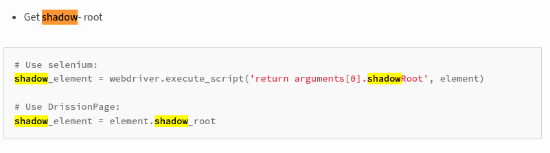
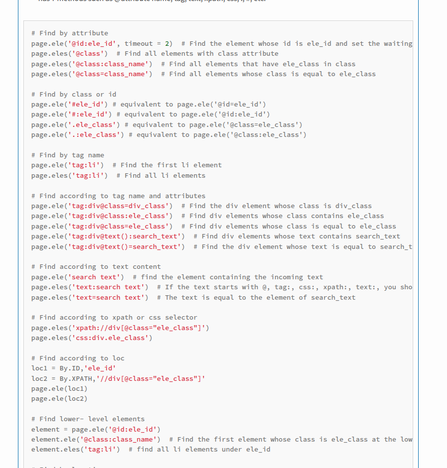
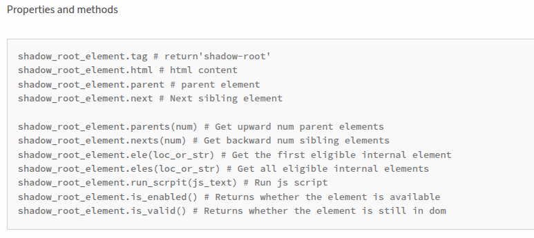

# Cloudflare Captcha Bypass 

Status: Working for both the urls mentioned in the task.

## Patchright

The idea was to:
1. Locate the hidden Turnstile response field: `<input type="hidden" name="cf-turnstile-response">`
2. Traverse to its parent container
3. Attempt to access its shadow root and locate the embedded iframe
4. Interact with the checkbox inside the shadow DOM of the iframe body

However, this failed at step 3. The parent element did not expose a usable shadow root—most likely because Cloudflare attaches the shadow root in **closed mode**. This makes it inaccessible via JavaScript (`el.shadowRoot` returns `null`) or browser automation APIs.

I explored some research and PoCs for bypassing this like Shadow root override attempts
* Related writeups:

  * [https://speakerdeck.com/masatokinugawa/shadow-dom-and-security-exploring-the-boundary-between-light-and-shadow](https://speakerdeck.com/masatokinugawa/shadow-dom-and-security-exploring-the-boundary-between-light-and-shadow?slide=19)
  * [https://extensions.neplox.security/Attacks/Shadow/](https://extensions.neplox.security/Attacks/Shadow/)

These ideas didn't work I think it demands better understanding of shadow dom or maybe some other exploits are also avalaible but have to go deeper in that.

---

## DrissionPage

So when the patchright and selennium approach failed after spending multiple hours I was searching about how to access shadow root in non open state and then found out this article which mentioned about accessing non open shadow root using DrissionPage [https://andrewji8-9527.xlog.app/selenium-de-xin-yi-dai-ti-dai-pin----DrissionPage](https://andrewji8-9527.xlog.app/selenium-de-xin-yi-dai-ti-dai-pin----DrissionPage?locale=en)

On the page [https://pypi.org/project/DrissionPage/1.7.4/](https://pypi.org/project/DrissionPage/1.7.4/) it is also mentioned that we can use selennium to access shadow root but it failed so I used DrissionPage.







Here’s how it worked:

1. The script starts by loading the page in an incognito Chrome instance.
2. It searches for the hidden input named `cf-turnstile-response`.
3. The parent of this input holds the Turnstile widget, which contains an iframe in its shadow root.
4. DrissionPage allows accessing the iframe inside the shadow root via `.shadow_root.child()`. This worked where Playwright failed.
5. Inside the iframe, it traverses to the `<body>` tag and accesses its own shadow root.
6. Within that, it locates the actual checkbox input (`<input type="checkbox">`) used for the Turnstile challenge.
7. The checkbox is clicked programmatically. After some time, the challenge resolves and we get the cf_clearance cookie.

```mermaid
flowchart TD
    A[Start at outer page] --> B["Find <input name='cf-turnstile-response'>"]
    B --> C["Get parent element (Turnstile container)"]
    C --> D["Access shadow root of container"]
    D --> E["Find <iframe> inside shadow root"]
    E --> F["Switch context into iframe"]
    F --> G["Find <body> inside iframe"]
    G --> H["Access shadow root of iframe body"]
    H --> I["Locate <input type='checkbox'> inside shadow root"]
    I --> J["Click checkbox"]
    J --> K["Wait and extract cf_clearance from cookies"]
```



---


## JavaScript Deobfuscation
Apart from CAPTCHA bypass, I also attempted to reverse-engineer the JavaScript-based challenges that Cloudflare issues before serving the CAPTCHA which can be solved by the browser but not us.

I explored whether the obfuscated JavaScript challenge could be deobfuscated or not using tools lkke obfuscatior.io, obfuscator-io-deobfuscator etc

Analyzing challenge payloads using burpsuite proxy but it seems to be fully encrypted and a bit complex to understand

Explored a few articles one which has some explaantions is this : [https://www.zenrows.com/blog/bypass-cloudflare#bypass-cloudflare-waiting-room](https://www.zenrows.com/blog/bypass-cloudflare#bypass-cloudflare-waiting-room)

While the article provided a basic overview of the techniques, the actual JavaScript logic served by Cloudflare was highly obfuscated—multiple layers deep, often involving dynamically constructed functions, proxy functions, jsFuck, environment fingerprinting etc etc.

In short: reversing the JS challenge manually proved too complex for now, and likely not feasible without deeper tooling or instrumentation.


*****

The repo contains all the code and I also added the html content of the captcha page in test.html file.

Also some articles mentioned about the proxy bypass like switiching IPs etc etc.

One more thing the cf_clearance cookie once obtained remains active for a long time so we can use that cookie with a certain order of headers like how browser sends them and we can easily get them using the burpsuite proxy so we can directly send a curl or a request module script to get rid of that captcha.

```bash
curl 'https://nopecha.com/demo/cloudflare' \
  -H 'accept: text/html,application/xhtml+xml,application/xml;q=0.9,image/avif,image/webp,image/apng,*/*;q=0.8' \
  -H 'accept-language: en-GB,en;q=0.5' \
  -H 'cache-control: max-age=0' \
  -b 'cf_clearance=L_E4b5aeOv6ctFsq8IpZOz.hHi62XgMw9aLbfJnfHiY-1753876952-1.2.1.1-RAnz9o71wHIWeq9IJqu0WAkpjO9GqfHe.D5n.McgJS2F0xtcCKLra2QBqspNqhhZra2s3seU6LACWSxtqqpBuqAjG_99.FLZrK5hmiAody8B3A4YN3U_fAFuovsYo5gZuytMqowpLaOV4f4RJ9jhrPViuwIlFB48VMUgBFeuE6Yj.tHklgPC4vA6m5uNL6HxZhMOUoEEqLOHRsdaHHa_iueg75JMycqJpaiiCXjCOeU' \
  -H 'priority: u=0, i' \
  -H 'referer: https://nopecha.com/demo/cloudflare?__cf_chl_tk=.MQ3wBkEae0UsVFo07h6pHNjoJjTYIm3iYCLNyeI5xk-1753876940-1.0.1.1-SZFbGF43B6Gm.dLB.IXWOAMxII1Ka4OGXStFZCXma2Y' \
  -H 'sec-ch-ua: "Not)A;Brand";v="8", "Chromium";v="138", "Brave";v="138"' \
  -H 'sec-ch-ua-arch: "x86"' \
  -H 'sec-ch-ua-bitness: "64"' \
  -H 'sec-ch-ua-full-version-list: "Not)A;Brand";v="8.0.0.0", "Chromium";v="138.0.0.0", "Brave";v="138.0.0.0"' \
  -H 'sec-ch-ua-mobile: ?0' \
  -H 'sec-ch-ua-model: ""' \
  -H 'sec-ch-ua-platform: "Linux"' \
  -H 'sec-ch-ua-platform-version: "6.8.0"' \
  -H 'sec-fetch-dest: document' \
  -H 'sec-fetch-mode: navigate' \
  -H 'sec-fetch-site: same-origin' \
  -H 'sec-fetch-user: ?1' \
  -H 'sec-gpc: 1' \
  -H 'upgrade-insecure-requests: 1' \
  -H 'user-agent: Mozilla/5.0 (X11; Linux x86_64) AppleWebKit/537.36 (KHTML, like Gecko) Chrome/138.0.0.0 Safari/537.36'


  Response:
  <p>Found. Redirecting to <a href="/demo">/demo</a></p>% 
```


```python
import requests

url = "https://nopecha.com/demo/cloudflare"

headers = {
    "accept": "text/html,application/xhtml+xml,application/xml;q=0.9,image/avif,image/webp,image/apng,*/*;q=0.8",
    "accept-language": "en-GB,en;q=0.5",
    "cache-control": "max-age=0",
    "priority": "u=0, i",
    "referer": "https://nopecha.com/demo/cloudflare?__cf_chl_tk=.MQ3wBkEae0UsVFo07h6pHNjoJjTYIm3iYCLNyeI5xk-1753876940-1.0.1.1-SZFbGF43B6Gm.dLB.IXWOAMxII1Ka4OGXStFZCXma2Y",
    "sec-ch-ua": '"Not)A;Brand";v="8", "Chromium";v="138", "Brave";v="138"',
    "sec-ch-ua-arch": '"x86"',
    "sec-ch-ua-bitness": '"64"',
    "sec-ch-ua-full-version-list": '"Not)A;Brand";v="8.0.0.0", "Chromium";v="138.0.0.0", "Brave";v="138.0.0.0"',
    "sec-ch-ua-mobile": "?0",
    "sec-ch-ua-model": '""',
    "sec-ch-ua-platform": '"Linux"',
    "sec-ch-ua-platform-version": '"6.8.0"',
    "sec-fetch-dest": "document",
    "sec-fetch-mode": "navigate",
    "sec-fetch-site": "same-origin",
    "sec-fetch-user": "?1",
    "sec-gpc": "1",
    "upgrade-insecure-requests": "1",
    "user-agent": "Mozilla/5.0 (X11; Linux x86_64) AppleWebKit/537.36 (KHTML, like Gecko) Chrome/138.0.0.0 Safari/537.36"
}

cookies = {
    "cf_clearance": "L_E4b5aeOv6ctFsq8IpZOz.hHi62XgMw9aLbfJnfHiY-1753876952-1.2.1.1-RAnz9o71wHIWeq9IJqu0WAkpjO9GqfHe.D5n.McgJS2F0xtcCKLra2QBqspNqhhZra2s3seU6LACWSxtqqpBuqAjG_99.FLZrK5hmiAody8B3A4YN3U_fAFuovsYo5gZuytMqowpLaOV4f4RJ9jhrPViuwIlFB48VMUgBFeuE6Yj.tHklgPC4vA6m5uNL6HxZhMOUoEEqLOHRsdaHHa_iueg75JMycqJpaiiCXjCOeU"
}

response = requests.get(url, headers=headers, cookies=cookies, allow_redirects=False)

print(response.status_code)
print(response.text)
```


```bash
python3 test.py
302
<p>Found. Redirecting to <a href="/demo">/demo</a></p>

```


Also to directly access the page just remove the `allow_redirects` option.
